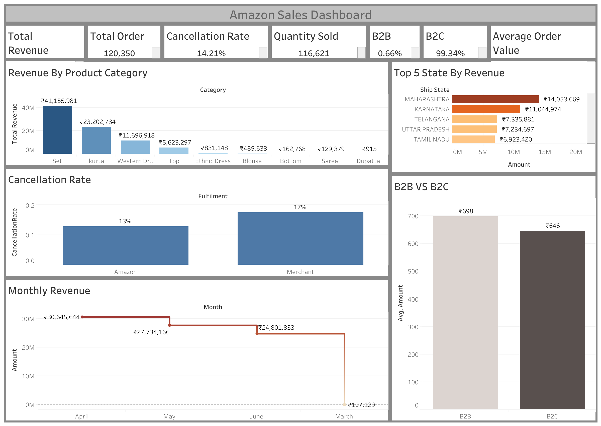

# Amazon Sales Performance Analysis



> End-to-end data analysis of 120,350+ Amazon orders using Python, SQL, and Tableau.  
> Built to answer real business questions from Sales.

---

## Live Dashboard

[View Interactive Dashboard on Tableau Public](https://public.tableau.com/app/profile/nishan.rana8637/viz/sales_17769431636950/Dashboard1)

---

## Project Overview

This project simulates a real-world data analyst scenario where i assume three stakeholders
from AmazonSell Co. requested data-driven answers to critical business questions.
The analysis covers product category performance, fulfilment efficiency, geographic
revenue distribution, and customer segment comparison.

---

## Business Questions 

> "Which product categories are actually making us money vs just moving volume?"


> "Are merchant-fulfilled orders performing worse than Amazon-fulfilled ones?
> Does shipping service level reduce cancellations?"


> "Which states drive the most revenue? Are B2B clients higher value
> than regular customers?"

---

## Tools Used

| Tool | Purpose |
|---|---|
| Python (pandas, matplotlib, seaborn) | Data cleaning and EDA |
| SQL (MySql) | Business queries and analysis |
| Tableau | Interactive dashboard |
| Jupyter Notebook | Analysis documentation |

---


---

## Dataset

- **Source:** Amazon Sales Dataset (Kaggle)
- **Raw rows:** 128,975 orders
- **Cleaned rows:** 120,350 orders
- **Columns:** 23 (after dropping empty column)
- **Date range:** April 2022 — June 2022
- **Key columns:** Order ID, Date, Status, Fulfilment, Category,
  Amount, ship-state, B2B, ship-service-level

---

## Data Cleaning Summary

| Issue Found | Action Taken |
|---|---|
| Unnamed: 22 column — completely empty | Dropped |
| fulfilled-by column — 70% missing | Dropped |
| Date column stored as string | Converted to datetime |
| Amount missing for 7,795 rows (6%) | Dropped rows |
| ship-state inconsistent naming | Standardized to uppercase |
| promotion-ids missing 38% | Filled with No Promotion |
| 33 rows with no location data | Dropped for geography analysis |
| Zero amount orders | Removed |

---

## Key Findings

### Finding 1 — Set and Kurta dominate revenue
Set (₹41.1M) and Kurta (₹23.2M) together account for 77% of total revenue.
However, smaller categories like Ethnic Dress and Blouse show higher
average order values, suggesting untapped premium potential.

### Finding 2 — Merchant fulfilment has 31% higher cancellation rate
Amazon-fulfilled orders cancel at 13% while merchant-fulfilled orders
cancel at 17% — a 31% relative difference. This directly impacts
customer satisfaction and represents recoverable lost revenue.

### Finding 3 — Maharashtra and Karnataka drive 30% of total revenue
Maharashtra alone generates ₹14.05M (17% of total revenue).
The top 5 states — Maharashtra, Karnataka, Telangana, Uttar Pradesh,
and Tamil Nadu — contribute over 60% of all revenue.

### Finding 4 — B2B customers spend more per order
B2B customers average ₹698 per order versus ₹646 for B2C customers —
an 8% higher average order value. Despite representing only 0.66%
of total orders, B2B is a higher-value segment worth prioritising.

### Finding 5 — Revenue declined through the quarter
Revenue peaked in April at ₹30.6M, declined to ₹27.7M in May,
and further to ₹24.8M in June — a 19% decline over the quarter.
This trend requires investigation into seasonal factors or
market conditions.

---

## Recommendations

1. **Prioritise Set and Kurta inventory** — these two categories
   drive 77% of revenue. Stock disruption here directly impacts
   the business.

2. **Migrate merchant sellers to Amazon fulfilment** — the 4
   percentage point cancellation rate difference costs the business
   significant revenue. Incentivise FBA adoption among top merchants.

3. **Focus sales investment on Maharashtra and Karnataka** —
   these two states alone generate ₹25M. Targeted marketing
   campaigns here have the highest ROI.

4. **Develop B2B acquisition strategy** — B2B customers spend
   8% more per order. Even a 1% shift in order share toward B2B
   would meaningfully increase average revenue per transaction.

5. **Investigate Q2 revenue decline** — the consistent month-on-month
   drop from April to June needs root cause analysis before
   the next quarter.

---

## Requirements

```
pandas
numpy
matplotlib
seaborn
jupyter
ipykernel
```
